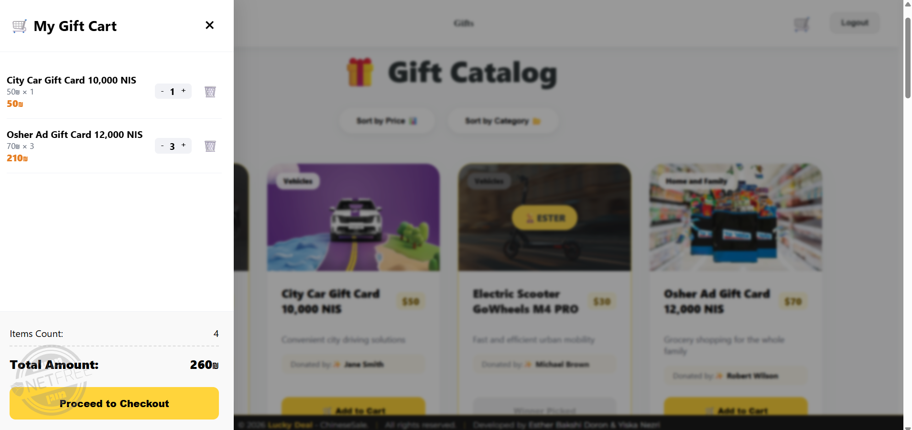

# Chinese Auction System

> A professional full‑stack Chinese auction platform built with Angular 18 and .NET 8 Web API.

A modern auction/giveaway application that lets end users browse gifts, add them to a shopping cart and checkout (purchase tickets), while administrators manage gifts, categories and donors through a CRUD interface.

---

## 📸 App Screenshots

### User Experience
| Gifts Catalog | Login Page |
| :---: | :---: |
|  |  |

### Administrative Dashboard
| Manage Gifts | Manage Purchases |
| :---: | :---: |
|  |  |

## 🚀 Key Features

- For Users
  - Browse available gifts with images and details
  - Add gifts to a shopping cart and proceed to checkout
  - View order history and ticket usage (where applicable)

- For Admins / Managers
  - Full CRUD for Gifts and Categories
  - Donor management (create/edit donors)
  - Seeded sample data for quick local setup

---

## 🧰 Technology Stack

- Frontend: Angular 18 (client/my-app)
- Backend: .NET 8 Web API (server/ChineseSaleApi)
- Data access: Entity Framework Core (EF Core)
- Database: configured via appsettings (local DB/SQL Server as configured)

---

## ⚙️ Prerequisites

- Node.js (recommended LTS)
- npm
- Angular CLI (optional, for development)
- .NET 8 SDK
- (Optional) EF Core tools if you want to run migrations locally

---

## 🧩 Setup & Run (Server)

1. Open a terminal and navigate to the server project:

```bash
cd server/ChineseSaleApi
```

2. Restore dependencies and run the API:

```bash
dotnet restore
dotnet run
```

- On the first run the application will seed sample data and images into the database (sample categories and gifts). The seeded gifts reference image files present under `wwwroot/images` such as `10.jpg`, `12.jpg` and `13.jpg`.
- If you use migrations manually, you can run:

```bash
# optional: ensure DB is up to date
dotnet ef database update
```

(Ensure EF tools are installed if you need to run migrations.)

---

## 🖥️ Setup & Run (Client)

1. Open a terminal and navigate to the Angular app:

```bash
cd client/my-app
```

2. Install dependencies and start the dev server:

```bash
npm install
npm start
# or using Angular CLI
ng serve --open
```

- The client expects the API to be available at the configured base URL (check `src/app/app.config.ts` / environment config). Update that if your API runs on a different host/port.

---

## 🌱 Database Seeding

- The server project contains an automatic seeding helper that inserts sample Categories (e.g., "Art", "Health", "Home"), sample Donors and sample Gifts on first run.
- Example seeded image filenames (present under `server/ChineseSaleApi/wwwroot/images`): `10.jpg`, `12.jpg`, `13.jpg`.

This makes it quick to spin up the system locally with realistic demo data.

---

## 🔧 Development Notes

- API controllers live under `server/ChineseSaleApi/Controllers`.
- Entity models and DbContext live under `server/ChineseSaleApi/Models` and `server/ChineseSaleApi/Data`.
- Angular components, services and assets are under `client/my-app/src/app` and `client/my-app/public`.

---

## 🧪 Tests

- Server unit tests are in `server/ChineseSaleApi.Tests`. Run them with:

```bash
cd server/ChineseSaleApi.Tests
dotnet test
```

- Client unit tests (if present) can be run with the Angular test runner:

```bash
cd client/my-app
npm test
# or
ng test
```

---

## 📦 Production Build

- Build the backend using `dotnet publish` and follow your preferred hosting/deployment steps.
- Build the frontend using:

```bash
cd client/my-app
npm run build
# or
ng build --configuration production
```

Then serve the generated static files from a web server or integrate into the backend's static files pipeline.

---

## 🤝 Contributing

Contributions and improvements are welcome. Please open issues or PRs describing the change and the rationale.

---

## 📞 Contact

For questions about running or extending the project, open an issue or contact the maintainers listed in the repository.

---

Made with ❤️ — enjoy building and testing the Chinese Auction System.
